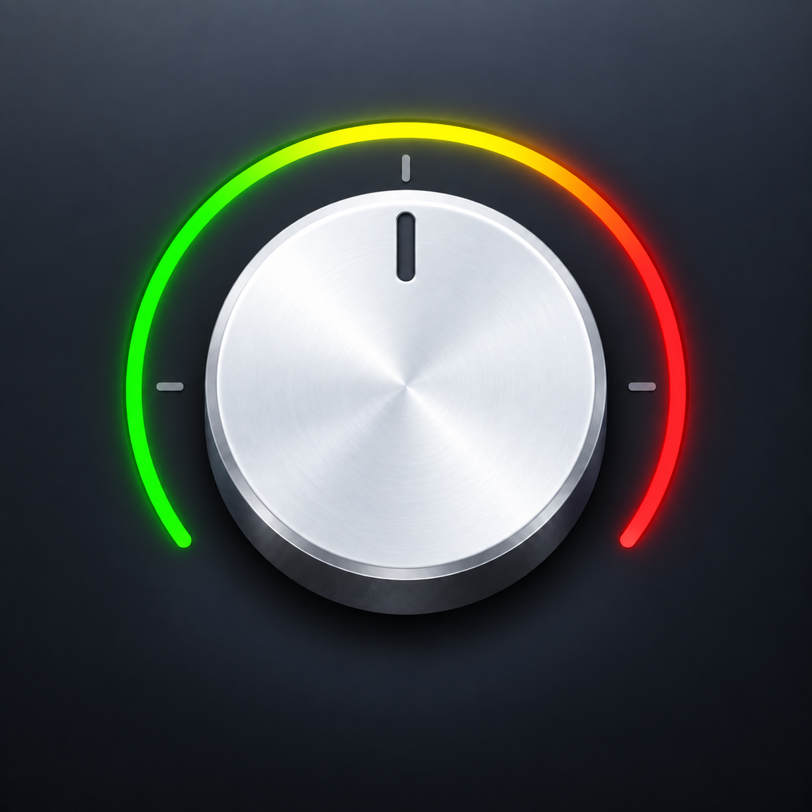
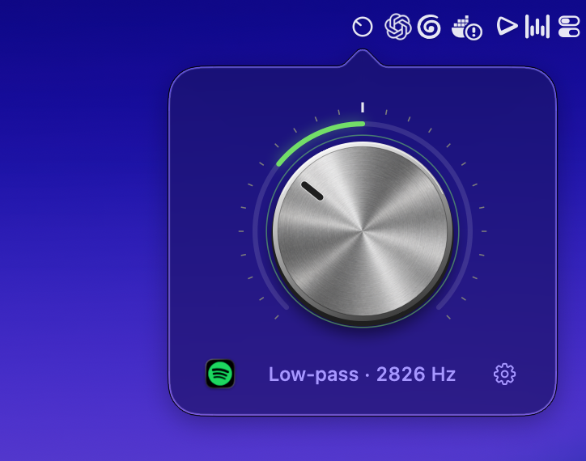

<h1></h1>

A little DJ filter for your Mac’s menu bar. Turn the knob to cut the highs or lows, or use a hold shortcut to drop into a preset and ease back when you let go.

**[Download Twiddle](https://github.com/parssak/twiddle/releases/latest)** · Apple Silicon · macOS 26+

v0.5 adds signed in-app updates while keeping the manual update check on the Settings wordmark.



## Install

Open the DMG, drag Twiddle into Applications, and launch it. The app is Developer ID-signed and the download is notarized by Apple.

Allow system audio recording when macOS asks. Twiddle also asks for access to Spotify so it can show the current song in the popover and album artwork in disco mode. Allow Accessibility to use ⌥F10–F12 directly on a media-key top row; if you set a hold shortcut, enable Input Monitoring. For top-row shortcuts, General settings shows **Allow Accessibility…** when access is missing and opens the correct System Settings pane. Twiddle retries the listener after access is granted; **Retry Shortcuts** is available if the listener still fails. Other permission changes may require reopening Twiddle.

## Use

- **Turn the knob:** left for low-pass, right for high-pass, center for the original audio. Drag or scroll; hold Shift for finer control.
- **Double-click:** smoothly reset to center.
- **⌥F10 / ⌥F11 / ⌥F12:** toggle between bypass and your preset, step down, or step up from anywhere. The menu-bar popover briefly shows each change.
- **Click the source icon:** choose which apps get filtered. Set trigger apps in Auto-apply settings.
- **Click FX:** open the live reverb, pitch, phaser, and Tape Stop controls.
- **Click the cog:** open Settings. Set the preset with its own knob, then use the hold shortcut to activate it.
- **Right-click the menu bar icon:** open Settings, manage the hold shortcut, or quit.

When Spotify is the first target app, the footer shows its current song. Adjusting the knob temporarily replaces it with the filter frequency, then blurs back to the song after a second. Long names stay pinned to the beginning, then scroll after a brief hover pause.

## Auto-apply and Settings

Settings has General and Auto-apply pages. General contains Apps to Twiddle. Auto-apply starts with the filter preset, followed by separate microphone, hold-shortcut, and trigger-app cards. You can record or clear the hold shortcut (None by default), choose your low/high colors, and choose audio apps in two grids. **Apps to Twiddle** selects which apps get filtered; **Apps that trigger Twiddle** holds the preset while any listed app is producing audio. Drag application bundles from Finder into either grid or use + Apps, and hover over an app and click it to remove it. Your previous default app becomes the initial target. Empty targets stop filtering; empty triggers disable playback automation. A shared level monitor releases the preset after 300 ms of silence, followed by a 180 ms fade; silent streams do not hold the preset. New installs enable Open at Login and trackpad haptics; either can be turned off in Settings. macOS may require approval for the login item.

The first Settings row opens macOS Menu Bar settings, where the system's “Allow in the Menu Bar” switch controls Twiddle's icon. If the icon is unavailable, reopening Twiddle from Applications, Spotlight, or Raycast opens that page directly.

**Apply when mic is active** applies the preset while **Any app** or **Wispr Flow** has an active audio input. It starts in Wispr Flow mode, enabled when Flow is installed; existing preferences are preserved. Twiddle excludes its own capture. This is experimental: virtual audio inputs and apps that keep their mic open while silent or muted can also activate it. The preset returns to your previous setting after all playback, microphone, shortcut, and disco triggers release.

Click the Twiddle wordmark in Settings to check, download, and install updates when disco mode is inactive.

Light trackpad haptics mark each tick, and the knob’s metallic reflections respond to lid movement on supported Macs. Filtering stays active when the popover closes. No audio is saved or uploaded.

This is an early release. Built-in speakers and wired stereo headphones are the best starting point; Bluetooth and multichannel setups haven’t been validated.

## Disco mode

Move your pointer across all the letters of the Twiddle wordmark in Settings to start disco mode, or use `twiddle disco on`. The screen dims and applies your Auto-apply preset immediately, then the disco ball drops in.

- **Pull the ball:** stretch and tilt its cord. Pull far enough to snap it back and cycle through album colours, warm, cool, and rainbow rays. Trackpad haptics build as you approach the snap point; a shorter pull springs back without changing the mode.
- **Swipe with two fingers over the ball:** speed up its spin or send it in the opposite direction. The extra momentum gradually settles.
- **Spotify now playing:** song, artist, and album artwork appear at the bottom left of each display, with blur transitions between tracks. Album mode samples colours from the current cover and falls back to white when artwork is missing or monochrome.
- **Exit:** click the ball, press Escape, close Settings, or run `twiddle disco off`. Another active Auto-apply trigger can keep the preset applied after disco ends.

Artwork loads asynchronously; Twiddle keeps the current cover and transition images rather than a permanent artwork collection. macOS may cache downloads.

## CLI

Twiddle v0.3 includes a CLI for users, scripts, and agents. Launch the app first. If you installed from the DMG, create the command with:

```sh
mkdir -p ~/.local/bin
ln -s /Applications/Twiddle.app/Contents/MacOS/Twiddle ~/.local/bin/twiddle
```

Ensure `~/.local/bin` is on your PATH. Source installs using `bash install.sh` create this link automatically. You can also run `/Applications/Twiddle.app/Contents/MacOS/Twiddle --cli status` directly.

```sh
twiddle status          # Inspect audio, filter, and automation state
twiddle set -0.5        # Low-pass (-1 to 1; positive values are high-pass)
twiddle preset -0.7     # Save the Auto-apply amount
twiddle apply           # Apply the saved amount manually
twiddle reset           # Fade back to bypass
twiddle disco on
twiddle disco off
twiddle settings
twiddle update
twiddle help
```

Commands return JSON, except `help`. `status` includes the current `value`, destination `target`, preset, selected apps, automation state, and any audio error. During a fade, `value` can differ from `target`. Use `disco on` or `disco off`; bare `disco` and `disco toggle` are not supported.

Manual `set`, `apply`, and `reset` commands override current automatic triggers until those triggers release. The CLI only accepts connections from the same macOS user and opens no network port. See [CLI usage, exit codes, and JSON responses](docs/CLI.md) for the full contract.

## Build

With Xcode command-line tools installed:

```sh
bash build.sh
open build/Twiddle.app
```

No dependencies to install. See [development notes](docs/DEVELOPMENT.md) for local installation, signing, and release packaging.
